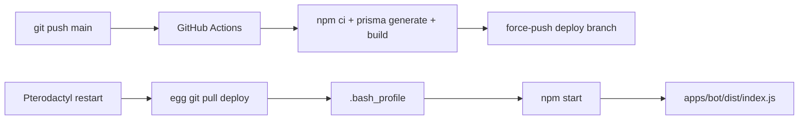

# bot-monorepo

Multi-platform chat bot untuk **WhatsApp** dan **Telegram** dengan satu command core. Modular per kategori, persistent di SQLite, ship ke Pterodactyl lewat CI build branch `deploy`.

> [!NOTE]
> Tulis feature sekali, route lewat `MessageCtx`, jalan di kedua adapter dengan guard, logging, rate limit, dan inline button (kalau platform support) yang sama.

## Highlights

- **Multi-platform core** via abstraksi `MessageCtx` di atas Baileys + grammY.
- **Modular features** per kategori (`general/`, `owner/`, `group/`) dengan auto-injected guards.
- **Persistent reminders** dengan transactional claim, restart catchup, recovery row stuck.
- **Telegram inline buttons** edit-in-place via callback; WA tetap text-only via capability flag.
- **Structured logging** dual sink: pretty terminal (kolom rapi, warna per status) + JSON daily file (rotate 7 hari, TZ-aware).
- **PII masking** otomatis di terminal log (`6289****8933`, `grp:1203****`, dll); JSON file tetap raw lengkap untuk forensics.
- **Encrypted WA auth** at rest pakai AES-256-GCM + `AUTH_ENCRYPTION_KEY`.
- **Crash-safe** signal handler + `uncaughtException`/`unhandledRejection` graceful shutdown dengan exit code beda.
- **TZ-validated** via Intl IANA check, fail-fast saat typo, fallback `Asia/Jakarta`.
- **Pterodactyl-ready** lewat GitHub Actions, `.bash_profile`, dan `npm start`.

## Stack

| Layer       | Pilihan                                                      |
| ----------- | ------------------------------------------------------------ |
| Runtime     | Node.js 20+, TypeScript strict, ESM                          |
| Monorepo    | npm workspaces + Turborepo                                   |
| WhatsApp    | `@whiskeysockets/baileys`                                    |
| Telegram    | `grammy` + `@grammyjs/conversations`                         |
| Database    | Prisma 7 + SQLite (WAL) via `@prisma/adapter-better-sqlite3` |
| Scheduler   | `croner`                                                     |
| Rate limit  | `bottleneck`                                                 |
| Middleware  | `koa-compose`                                                |
| Logger      | `pino` + `pino-roll` + custom prettifier                     |
| Validation  | `zod`                                                        |
| Tests       | `vitest`                                                     |

## Project structure

```text
apps/
  bot/            # combined entry (WA + Telegram, satu process)
  wa/             # WhatsApp-only entry
  tele/           # Telegram-only entry
packages/
  contracts/      # shared types: MessageCtx, Feature, AppContext, ReplyButton, ChatType
  core/           # router, parser, command-registry, middleware, scheduler, event-bus, errors
  features/       # general/, owner/, group/ feature modules
  adapters/       # WA + Telegram adapter glue, registry
  db/             # Prisma client + repositories
  utils/          # config (zod), logger (pino + custom prettifier), crypto, time
prisma/           # schema + migrations
docs/             # prd, architect, tech-spec, deploy runbook, changelog/
.github/          # CI: build + force-push ke branch deploy
```

## Quickstart

> [!IMPORTANT]
> Butuh **Node.js 20+** dan **npm 10+**. Generate `AUTH_ENCRYPTION_KEY` dengan `openssl rand -hex 32` (atau `node -e "console.log(require('crypto').randomBytes(32).toString('hex'))"`) sebelum run pertama.

```bash
# 1. Install
npm install

# 2. Configure
cp .env.example .env
# isi AUTH_ENCRYPTION_KEY, OWNER_WA, OWNER_TG, TELEGRAM_BOT_TOKEN

# 3. Database
npx prisma migrate dev

# 4. Build + test
npm run build
npm test

# 5. Run
npm run dev          # combined bot (WA + Tele)
npm run dev:wa       # WhatsApp-only
npm run dev:tele     # Telegram-only
```

Boot pertama WA prints QR di terminal; scan dari device. Auth blob disimpan terenkripsi di SQLite, restart berikutnya skip QR otomatis.

## Commands

Prefix `/` atau `.` di kedua platform. Contoh: `/ping` ≡ `.ping`.

| Kategori | Commands                                              |
| -------- | ----------------------------------------------------- |
| General  | `/ping`, `/stats`, `/help`, `/menu`, `/start`         |
| General  | `/remind`, `/reminders`, `/cancelreminder`            |
| Owner    | `/eval`, `/broadcast`, `/shutdown`                    |
| Group    | `/kick`, `/mute`, `/antilink`, `/welcome`             |

> [!TIP]
> Telegram replies attach inline button (Refresh, Menu, Back). Tap = edit message asal in place, bukan kirim baru. WA tetap text-only karena `capabilities.buttons = false`.

## Scripts

| Script                                     | Deskripsi                                              |
| ------------------------------------------ | ------------------------------------------------------ |
| `npm run build`                            | Turbo build semua workspace                            |
| `npm test`                                 | Vitest run setiap package                              |
| `npm run lint`                             | ESLint dengan `--max-warnings=0`                       |
| `npm run format` / `format:check`          | Prettier write / verify                                |
| `npm run dev` / `dev:wa` / `dev:tele`      | Watch mode (tsx) per entry                             |
| `npm start` / `start:wa` / `start:tele`    | Production: `prisma migrate deploy` lalu run dist      |
| `npm run prisma:migrate` / `prisma:deploy` | Schema migration dev / deploy                          |

## Writing a feature

Drop file di folder kategori, register di `packages/features/src/_loader.ts`. Folder = identitas guard.

```ts
// packages/features/src/general/ping.ts
import type { Feature } from '@bot/contracts';
import { reply } from '@bot/contracts';

const ping: Feature = {
  name: 'ping',
  version: '1.0.0',
  commands: [
    {
      name: 'ping',
      description: 'Reply with pong',
      usage: '/ping',
      async handler(ctx) {
        await reply(ctx, `pong ${Date.now() - ctx.timestamp}ms`, {
          buttons: [[{ label: '🔄 Refresh', command: 'ping' }]],
        });
      },
    },
  ],
};

export default ping;
```

| Folder      | Guard otomatis                      |
| ----------- | ----------------------------------- |
| `general/`  | tanpa guard                         |
| `owner/`    | `requireOwner()`                    |
| `group/`    | `requireGroup()` + `requireOwner()` |

`reply()` helper otomatis strip `buttons` di platform yang tidak support, dan auto-append baris `⬅ Kembali` (set `backTo: false` di root screen seperti `/menu` atau `/start`).

## Configuration

Semua config divalidasi `zod` di `@bot/utils/config.ts`. Field utama:

| Variable                                          | Required        | Notes                                                                |
| ------------------------------------------------- | --------------- | -------------------------------------------------------------------- |
| `NODE_ENV`                                        | yes             | `development` / `production` / `test`                                |
| `TZ`                                              | yes             | IANA TZ name; validated via Intl; fallback `Asia/Jakarta`            |
| `DATABASE_URL`                                    | yes             | contoh: `file:/home/container/data/bot.db`                           |
| `AUTH_ENCRYPTION_KEY`                             | yes             | 64-hex, encrypts WA auth blob at rest                                |
| `WA_ENABLED` / `OWNER_WA`                         | yes kalau WA on | JID owner (`62…@s.whatsapp.net`)                                     |
| `TELE_ENABLED` / `TELEGRAM_BOT_TOKEN` / `OWNER_TG`| yes kalau Tele on| token dari BotFather, OWNER_TG = username/id                        |
| `LOG_LEVEL`                                       | optional        | `trace`/`debug`/`info`/`warn`/`error`; default `info`                |
| `LOG_DIR`                                         | optional        | direktori log; default `<cwd>/data/log`                              |
| `LOG_NO_COLOR`                                    | optional        | `true` untuk disable warna terminal                                  |
| `LOG_PII`                                         | optional        | `true` = tampilkan ID raw di terminal (dev only). JSON file selalu raw.|
| `WA_RATE_MIN_TIME_MS` / `TELE_RATE_MIN_TIME_MS`   | optional        | jeda min antar outbound per chat                                     |

Tipe `AppConfig` di `@bot/contracts` dijaga compile-time terhadap zod schema; schema drift = build fail.

> [!NOTE]
> Project ini cuma punya `.env` (lokal) dan `.env.example` (template). Switch dev vs prod cukup lewat `NODE_ENV` (sudah di-handle `cross-env` di npm scripts).

Daftar lengkap di [`.env.example`](.env.example) dan [`docs/tech-spec.md`](docs/tech-spec.md).

## Logging

Logger run dual sink:

- **Terminal** (pretty, custom prettifier): kolom fixed-width — `time · status · platform · type · who · command │ msg`. Warna per status (`OK` hijau, `WARN` kuning, `ERROR` merah, `FATAL` merah pekat). PII otomatis di-mask kecuali `LOG_PII=true`.
- **File JSON** (`pino-roll`): NDJSON di `data/log/bot.YYYY-MM-DD.1.log`. Rotate harian di midnight TZ, keep 7 file terakhir, hari ke-8 yang terlama auto-delete. Field lengkap (eventId, traceId, chatType, chatName, userName, durationMs, err.stack) untuk grep/jq.

Contoh terminal output:

```text
00:42:35.935  OK    wa  PC  Manzz · 6289****8933              /ping              │ handled · 121ms
00:44:30.500  OK    wa  GC  Sat Set Meet › 6289****8933       /everyone          │ tagged 12 members
00:45:11.882  ERROR tg  GC  Bot Test › @Mannn678              /stats             │ TypeError: Cannot read 'count' of undefined
                                                                                   ╰─ at handler (general/stats.ts:42:18)
                                                                                   ╰─ at compose (router.ts:88:5)
00:50:01.001  FATAL —   —   system                            uncaught           │ ENOSPC: no space left on device
```

Forensics dari file JSON:

```bash
# trace 1 request lengkap
jq 'select(.traceId == "01KS7GFX...")' data/log/bot.*.log

# semua aktivitas user
jq 'select(.userId | test("6289"))' data/log/bot.*.log

# error+fatal hari ini
jq 'select(.level >= 50)' data/log/bot.2026-05-27.1.log
```

## Reliability

- **Reminder recovery**: tiap scheduler tick reset reminder yang stuck di status `firing` >5 menit kembali ke `pending`. Crash mid-fire tidak meninggalkan row terkunci.
- **Crash handling**: `uncaughtException` + `unhandledRejection` route ke graceful shutdown yang sama (pause adapter → stop scheduler → drain in-flight → disconnect Prisma → flush log → exit `1`). Stop normal exit `0`. Panel bisa bedakan crash vs clean stop.
- **Error boundary** middleware: per-message error di-log dengan `traceId` dan reply ke user `Internal error. Trace: <id>`, tapi **tidak** flush logs. Flush dipakai khusus jalur fatal/exit.
- **TZ preflight**: `bootstrap.ts` validate `process.env.TZ` via `Intl.DateTimeFormat` sebelum modul lain di-import. Typo (`Asai/Jakarta`) → stderr warning + auto-fallback `Asia/Jakarta`.
- **Logger transport fallback**: kalau worker `pino-roll` mati (disk penuh, dll), 1 baris JSON `level:60 status:fatal` di-emit ke stderr supaya tetap visible di `docker logs`/`journalctl`/panel.

## Deployment

Single Pterodactyl process pull artifact dari branch `deploy` yang dibangun CI.



> [!TIP]
> Set `AUTO_UPDATE=true` di egg supaya tiap restart pull tip terbaru `deploy`. Bot run `prisma migrate deploy` sebelum boot, schema change apply otomatis.

Runbook penuh (egg variables, persistent layout, hot backup, verifikasi): [`docs/deploy-pterodactyl.md`](docs/deploy-pterodactyl.md).

## Operational checks

```bash
# WAL aktif
sqlite3 /home/container/data/bot.db "PRAGMA journal_mode;"

# Auth blob terenkripsi (hex bytes, bukan JSON plaintext)
sqlite3 /home/container/data/bot.db "SELECT hex(encryptedBlob) FROM WAAuthState LIMIT 1;"

# Log sehat (ada eventId per record, ada localTime di boot record)
jq 'select(.msg == "Bot bootstrap complete")' /home/container/data/log/bot.*.log

# SQLite hot backup (WAL-safe, no downtime)
mkdir -p /home/container/backups
sqlite3 /home/container/data/bot.db ".backup '/home/container/backups/bot-$(date +%s).db'"
```

> [!WARNING]
> Jangan `cp` file SQLite pas bot running. Pakai `.backup` di atas — copy via WAL aman tanpa lock.

## Documentation

- [`docs/prd.md`](docs/prd.md) — product requirements
- [`docs/architect.md`](docs/architect.md) — architecture overview + diagram
- [`docs/tech-spec.md`](docs/tech-spec.md) — technical spec, contracts, error model
- [`docs/deploy-pterodactyl.md`](docs/deploy-pterodactyl.md) — deploy + ops runbook
- [`docs/changelog/`](docs/changelog) — changelog per tanggal
- [`docs/superpowers/specs/2026-05-22-bot-monorepo-design.md`](docs/superpowers/specs/2026-05-22-bot-monorepo-design.md) — original design (D1–D26 decisions)
- [`docs/superpowers/plans/`](docs/superpowers/plans) — implementation plans per slice