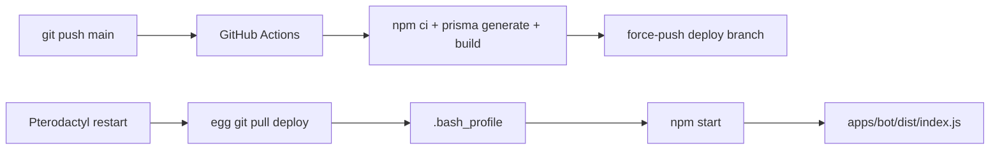

# bot-monorepo

A multi-platform chat bot for **WhatsApp** and **Telegram**, sharing one command core. Modular by category, persistent on SQLite, and shipped to Pterodactyl from a CI-built `deploy` branch.

> [!NOTE]
> Write a feature once, route it through `MessageCtx`, and it works on both adapters with the same guards, logging, rate limits, and (where supported) inline buttons.

## Highlights

- **Multi-platform core** via `MessageCtx` over Baileys and grammY.
- **Modular features** by category (`general/`, `owner/`, `group/`) with auto-injected guards.
- **Persistent reminders** with transactional claim, restart catchup, and stuck-row recovery.
- **Telegram inline buttons** with edit-in-place callback flow; WA stays text-only via capability flag.
- **Structured logging** with `pino` dual transport — same `eventId` in stdout and rotated JSON file.
- **Encrypted WhatsApp auth** at rest using AES-256-GCM + `AUTH_ENCRYPTION_KEY`.
- **Crash-safe** signal + `uncaughtException` handler with distinct exit codes.
- **Pterodactyl-ready** deploy via GitHub Actions, `.bash_profile`, and `npm start`.

## Stack

| Layer      | Choice                                                       |
| ---------- | ------------------------------------------------------------ |
| Runtime    | Node.js 20+, TypeScript 5 strict, ESM                        |
| Monorepo   | npm workspaces + Turborepo                                   |
| WhatsApp   | `@whiskeysockets/baileys`                                    |
| Telegram   | `grammy` + `@grammyjs/conversations`                         |
| Database   | Prisma 7 + SQLite (WAL) via `@prisma/adapter-better-sqlite3` |
| Scheduler  | `croner`                                                     |
| Rate limit | `bottleneck`                                                 |
| Middleware | `koa-compose`                                                |
| Logger     | `pino` + `pino-pretty` + `pino-roll`                         |
| Tests      | `vitest`                                                     |

## Project structure

```text
apps/
  bot/            # combined entry (WA + Telegram in one process)
  wa/             # WhatsApp-only entry
  tele/           # Telegram-only entry
packages/
  contracts/      # shared types (MessageCtx, Feature, AppContext, ReplyButton)
  core/           # router, parser, middleware, scheduler, event bus
  features/       # general/, owner/, group/ feature modules
  adapters/       # WA + Telegram adapter glue
  db/             # Prisma client + repos
  utils/          # config, logger, crypto, time
prisma/           # schema + migrations
docs/             # prd, architect, tech-spec, deploy runbook
.github/          # CI: build + push to deploy branch
```

## Quickstart

> [!IMPORTANT]
> Requires **Node.js 20+** and **npm 10+**. Generate `AUTH_ENCRYPTION_KEY` with `openssl rand -hex 32` before first run.

```bash
# 1. Install
npm install

# 2. Configure
cp .env.example .env
# fill DATABASE_URL, AUTH_ENCRYPTION_KEY, TELEGRAM_BOT_TOKEN, OWNER_WA, OWNER_TG

# 3. Database
npx prisma migrate dev

# 4. Build + test
npm run build
npm test

# 5. Run
npm run dev          # combined bot
npm run dev:wa       # WhatsApp only
npm run dev:tele     # Telegram only
```

On first WhatsApp boot, scan the QR printed in the terminal. Auth state is persisted (encrypted) so subsequent restarts skip the QR.

## Commands

All commands accept either `/` or `.` as prefix on both platforms. Examples: `/ping` or `.ping`.

| Category | Commands                                                     |
| -------- | ------------------------------------------------------------ |
| General  | `/ping`, `/stats`, `/help`, `/menu`, `/start`                |
| General  | `/remind`, `/reminders`, `/cancelreminder`                   |
| Owner    | `/eval`, `/broadcast`, `/shutdown`                           |
| Group    | `/kick`, `/mute`, `/antilink`, `/welcome`                    |

> [!TIP]
> On Telegram, replies attach inline buttons (Refresh, Menu, Back, etc.). Clicking a button edits the source message in place rather than sending a new one. WA stays text-only because `capabilities.buttons` is `false`.

## Scripts

| Script                                     | Description                                       |
| ------------------------------------------ | ------------------------------------------------- |
| `npm run build`                            | Turbo build across all workspaces                 |
| `npm test`                                 | Run vitest in every package                       |
| `npm run lint`                             | ESLint with `--max-warnings=0`                    |
| `npm run format` / `format:check`          | Prettier write / verify                           |
| `npm run dev` / `dev:wa` / `dev:tele`      | Watch mode entries                                |
| `npm start` / `start:wa` / `start:tele`    | Production: `prisma migrate deploy` then run dist |
| `npm run prisma:migrate` / `prisma:deploy` | Schema migrations                                 |

## Writing a feature

Drop a file into a category folder and register it in `packages/features/src/_loader.ts`. Category controls auto-guards.

```ts
// packages/features/src/general/ping.ts
import type { Feature } from '@bot/contracts';
import { reply } from '@bot/contracts';

const ping: Feature = {
  name: 'ping',
  version: '1.0.0',
  commands: [
    {
      name: 'ping',
      description: 'Reply with pong',
      usage: '/ping',
      async handler(ctx) {
        await reply(ctx, `pong ${Date.now() - ctx.timestamp}ms`, {
          buttons: [[{ label: '🔄 Refresh', command: 'ping' }]],
        });
      },
    },
  ],
};

export default ping;
```

| Category   | Auto-injected guards                |
| ---------- | ----------------------------------- |
| `general/` | none                                |
| `owner/`   | `requireOwner()`                    |
| `group/`   | `requireGroup()` + `requireOwner()` |

The `reply()` helper auto-strips `buttons` on platforms that don't support them and auto-appends a `⬅ Kembali` row (pass `backTo: false` for root screens like `/menu` or `/start`).

## Configuration

All config goes through a `zod`-validated env. Key fields:

| Variable                                           | Required       | Notes                                       |
| -------------------------------------------------- | -------------- | ------------------------------------------- |
| `DATABASE_URL`                                     | yes            | e.g. `file:/home/container/data/bot.db`     |
| `AUTH_ENCRYPTION_KEY`                              | yes            | 64-hex chars, encrypts WA auth blob at rest |
| `WA_ENABLED` / `OWNER_WA`                          | yes if WA on   | JID of owner                                |
| `TELE_ENABLED` / `TELEGRAM_BOT_TOKEN` / `OWNER_TG` | yes if Tele on | from BotFather                              |
| `LOG_LEVEL`, `LOG_DIR`, `LOG_NO_COLOR`             | optional       | defaults to `info`, `./data/log`            |

The `AppConfig` type lives in `@bot/contracts` and is verified at compile time against the zod schema in `@bot/utils`, so schema drift fails the build instead of silently slipping through.

Full list in [`.env.example`](.env.example) and [`docs/tech-spec.md`](docs/tech-spec.md).

## Deployment

Deploy targets a single Pterodactyl process pulling the CI-built `deploy` branch.



> [!TIP]
> Set `AUTO_UPDATE=true` on the egg so each restart pulls the latest `deploy` tip. The bot runs `prisma migrate deploy` before booting, so schema changes apply automatically.

Full runbook with egg variables, persistent data layout, hot backup, and verification: [`docs/deploy-pterodactyl.md`](docs/deploy-pterodactyl.md).

## Operational checks

After first boot:

```bash
# WAL active
sqlite3 /home/container/data/bot.db "PRAGMA journal_mode;"

# Log fan-out: same eventId in terminal AND file
grep '<eventId>' /home/container/data/log/bot-*.log

# Auth blob encrypted (hex bytes, not JSON)
sqlite3 /home/container/data/bot.db "SELECT hex(encryptedBlob) FROM WAAuthState LIMIT 1;"

# SQLite hot backup (WAL-safe, no downtime)
mkdir -p /home/container/backups
sqlite3 /home/container/data/bot.db ".backup '/home/container/backups/bot-$(date +%s).db'"
```

> [!WARNING]
> Never `cp` the SQLite file while the bot is running. Use the `.backup` command above; it copies through the WAL safely.

## Reliability notes

- **Reminder recovery**: every scheduler tick first resets reminders stuck in `firing` longer than 5 min back to `pending`, so a hard crash mid-fire never strands a row.
- **Crash handling**: `uncaughtException` and `unhandledRejection` route through the same graceful shutdown path with exit code `1`, so the panel can distinguish a crash from a clean stop.
- **Error boundary**: per-message errors are logged with the matching `traceId` but do **not** flush logs (flush is reserved for the fatal/exit path).

## Documentation

- [`docs/prd.md`](docs/prd.md) — product requirements
- [`docs/architect.md`](docs/architect.md) — architecture overview + diagrams
- [`docs/tech-spec.md`](docs/tech-spec.md) — technical spec, contracts, error model
- [`docs/deploy-pterodactyl.md`](docs/deploy-pterodactyl.md) — deploy + ops runbook
- [`docs/superpowers/specs/2026-05-22-bot-monorepo-design.md`](docs/superpowers/specs/2026-05-22-bot-monorepo-design.md) — original design (D1–D26 decisions)