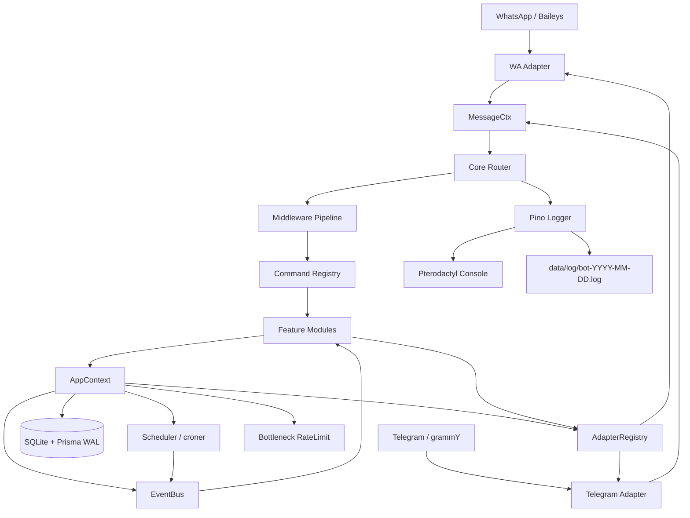
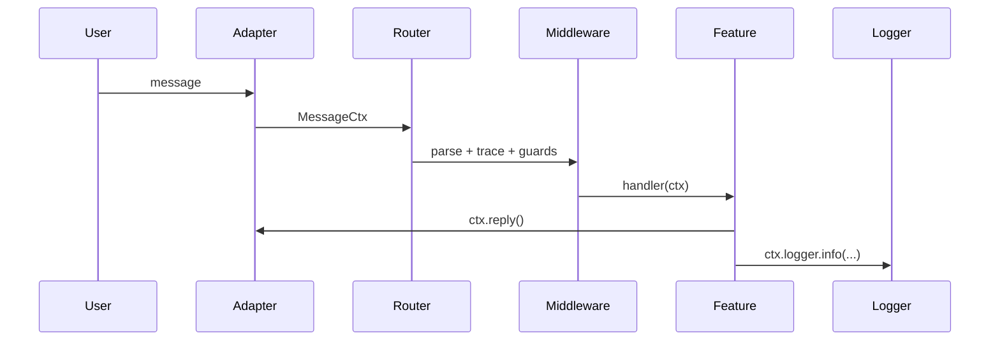
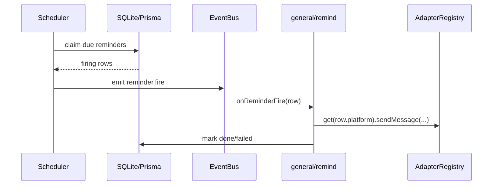
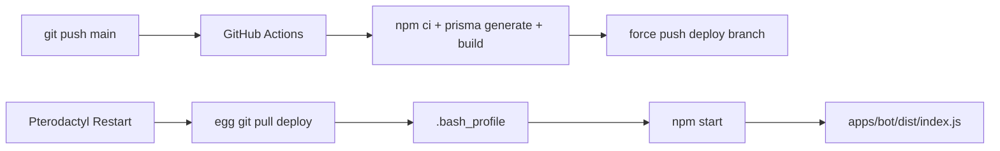

# Architecture — Bot Monorepo (WhatsApp + Telegram)

- **Status**: Draft v1
- **Date**: 2026-05-22
- **Source of truth**: `docs/superpowers/specs/2026-05-22-bot-monorepo-design.md`

## 1. Architecture Summary

The system is a single-process, multi-platform bot runtime. WhatsApp and Telegram adapters normalize native updates into `MessageCtx`, then core routes commands/events into feature modules. Persistence uses SQLite + Prisma with WAL. Deployment targets Pterodactyl as a single server/process tree.

Core rule: **adapters know platforms, features do not**. Kalau feature mulai import Baileys/grammY langsung, arsitektur lu udah mulai busuk.

## 2. System Diagram



## 3. Monorepo Layout

```text
apps/
  bot/       # orchestrator, default Pterodactyl entry
  wa/        # WhatsApp-only entry for dev/future split
  tele/      # Telegram-only entry for dev/future split
packages/
  contracts/ # pure interfaces/types
  core/      # router, registry, middleware, parser, event bus
  adapters/  # wa/tele adapters
  db/        # Prisma client + repos
  features/  # general/owner/group modules
  utils/     # config, logger, crypto, time
prisma/      # schema + migrations
.github/workflows/deploy.yml
```

## 4. Runtime Topology

Pterodactyl runs exactly one default process:

```text
npm start
  -> npx prisma migrate deploy
  -> node apps/bot/dist/index.js
        -> build AppContext
        -> register features
        -> start WA adapter
        -> start Telegram adapter
        -> start scheduler
```

Standalone entries exist for dev and future split:

- `npm run dev:wa` / `npm run start:wa`
- `npm run dev:tele` / `npm run start:tele`

## 5. Package Responsibilities

| Package     | Responsibility                                                         | Must Not Do                               |
| ----------- | ---------------------------------------------------------------------- | ----------------------------------------- |
| `contracts` | Shared interfaces: `MessageCtx`, `Feature`, `Command`, `AppContext`    | Runtime side effects                      |
| `core`      | Routing, parsing, middleware, registry, event bus                      | Import platform clients                   |
| `adapters`  | Convert native WA/Tele updates to `MessageCtx`; send outbound messages | Own business logic                        |
| `features`  | Commands/events/user-facing behavior                                   | Import raw Baileys/grammY in shared files |
| `db`        | Prisma client, repos, WAL init                                         | Business orchestration                    |
| `utils`     | Config, logger, crypto, time helpers                                   | Feature-specific logic                    |

## 6. Key Boundaries

### Adapter Boundary

Native platform events are transformed into `MessageCtx`:

- identity: platform, messageId, chatId, userId, isGroup
- content: text, command, args, flags, media
- actions: reply, edit, delete, react
- observability: logger, traceId
- escape hatch: raw event, forbidden in shared feature handlers

### Feature Boundary

Features only interact through:

- `ctx` for current message behavior
- `AppContext` for DB, event bus, scheduler, adapter registry
- `Command.guards` for access control
- `EventSubscription` for async flows like reminders/welcome

### Persistence Boundary

SQLite file lives at `/home/container/data/bot.db`. Prisma owns schema/migration. WAL setup runs at DB client initialization.

## 7. Feature Organization

Features are grouped by access scope:

```text
features/src/general/ping.ts
features/src/general/remind/index.ts
features/src/owner/eval.ts
features/src/group/kick.ts
```

Category behavior:

| Category  | Guard                                       |
| --------- | ------------------------------------------- |
| `general` | none                                        |
| `owner`   | `requireOwner()`                            |
| `group`   | `requireGroup()` + `requireOwner()` for MVP |

Flat file is default. Folder is used only when a feature needs multi-command handlers, event subscriptions, helpers, tests, or per-platform modules.

## 8. Data Architecture

Core tables:

- `User` — platform-native user identity.
- `Group` — platform-native group identity.
- `GroupConfig` — mute, antilink, welcome.
- `Reminder` — durable scheduled jobs.
- `WAAuthState` — encrypted Baileys auth blob.

SQLite pragmas at boot:

- `journal_mode=WAL`
- `synchronous=NORMAL`
- `busy_timeout=5000`
- `foreign_keys=ON`

## 9. Event Flow

### Command Flow



### Reminder Flow



## 10. Logging Architecture

One pino root logger fans out the same event to:

- stdout pretty, single-line in production, for Pterodactyl Console.
- JSON Lines file rotated daily in `/home/container/data/log`.

Every event includes:

- `eventId`
- `traceId`
- `status`
- `platform`
- `userId`
- `chatId`
- `command`
- `feature`

Critical rule: if terminal shows an error, the file must have the same `eventId` within <=2s.

## 11. Deployment Architecture



## 12. Scaling Path

| Trigger                      | Next Step                                      |
| ---------------------------- | ---------------------------------------------- |
| Baileys crashes often        | Move WA/Tele adapter to `worker_threads`       |
| Need Redis/metrics/dashboard | Migrate from Pterodactyl to VPS/docker-compose |
| Need WA reliable buttons     | Add WhatsApp Business Cloud API adapter        |
| Feature category >10 modules | Add one more category depth                    |

## 13. Architectural Decisions

Canonical source: D1-D26 in the design spec.

| Range   | Decisions                                                          | Architecture consequence                                                                  |
| ------- | ------------------------------------------------------------------ | ----------------------------------------------------------------------------------------- |
| D1-D3   | Single orchestrator, npm workspaces, SQLite+Prisma WAL             | One Pterodactyl process; simple deploy; DB is file-backed but WAL-safe.                   |
| D4-D5   | Baileys + grammY                                                   | Platform-specific logic stays in adapters.                                                |
| D6-D7   | Internal features + envelope-encrypted WA auth                     | No third-party plugin runtime; auth blob is protected but env key remains trust boundary. |
| D8-D12  | croner, bottleneck, yargs-parser, owner middleware, vitest         | Core avoids DIY scheduler/parser/test harness stupidity.                                  |
| D13-D17 | MVP exclusions + Pterodactyl deploy + env panel                    | No Redis/CF tunnel/webhook/KMS in MVP; env comes from `CUSTOM_ENVIRONMENT_VARIABLES`.     |
| D18-D19 | `koa-compose` + transactional reminder claim                       | Middleware pipeline is standard; reminder double-fire is prevented.                       |
| D20-D24 | `apps/{bot,wa,tele}`, capabilities, category features, flat layout | Good dev UX without true split; feature path controls behavior.                           |
| D25-D26 | Dual transport logger + consistency invariant                      | Terminal/file logs share `eventId`; `error/fatal` flush before exit.                      |

## 14. Architecture Follow-ups

| OQ       | Architecture hook                                                            |
| -------- | ---------------------------------------------------------------------------- |
| OQ1/OQ12 | Add `requireGroupAdmin()` middleware using WA/Tele group metadata.           |
| OQ2      | Add Tele command sync script from `CommandRegistry`.                         |
| OQ3      | Generalize `WAAuthState.id` loader for multiple sessions.                    |
| OQ4      | Extend `GroupConfig` with whitelist storage.                                 |
| OQ5      | Move adapters to `worker_threads` before full multi-proc split.              |
| OQ7      | Swap env secrets for external secret manager if hosting allows.              |
| OQ8      | Change Bottleneck cache eviction from size-only to idle-based.               |
| OQ9/OQ10 | Add per-platform feature modules (`tele.ts`, `wa.ts`) or `wa-cloud` adapter. |
| OQ11     | Extend feature loader to support `<category>/<sub>/<feature>`.               |
